# Helping-Hand

<a href="https://github.com/gruvw/helping-hand/releases/latest" target="_blank"></a>

Trigger any button on any remote control using your digital devices.

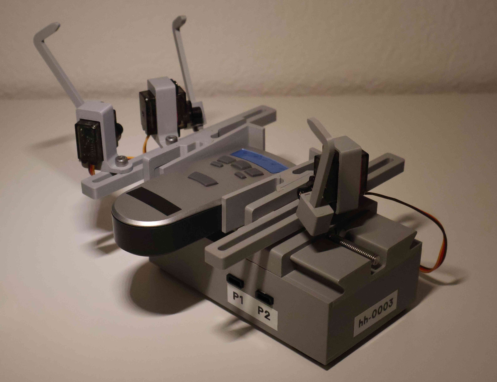

This project started from a simple observation: many things already present in our homes are not "smart" or connected, even though they have a remote controller (blinds, garage doors, air conditioning, etc.), and when they are connected, they often each have their own separate mobile application.
On top of that, those applications are often poorly designed, requiring you to create an account to log in, they aren't cross-platform (meaning they are not accessible from a computer, a web browser, or only available on iOS/Android), and are very rarely designed with accessibility in mind.

So instead of replacing a perfectly working home appliance with a commercial "smart" one that comes with the flaws mentioned above, Helping-Hand is an inexpensive solution that adapts to your existing remote controllers.
You can install a remote control inside the device and configure a small servo motor module for each button you want to control.
The device turns your regular remote control into a connected appliance, controllable from a cross-platform application available on your smartphone, tablet, and computer.

You can check out a short video demo of the system, with a focus on its accessibility features: <https://youtu.be/LdWC4-ZtAj0>.

Take a look at the project's [roadmap](docs/roadmap.md) to see upcoming features (along with all the work accomplished).

**Note**: Currently the project's focus is to adapt radio-based remote controls, which are significantly harder to recreate than infrared (IR) based ones for security reasons.
Although the current device can work for IR-based remotes, it probably won't be the most appropriate solution.
The goal is to later create another device that integrates into the same system, dedicated to IR remotes, that will be able to record and replay basic IR command.
Such device won't even require the original remote or servo motors.

## Philosophy

The core principles of the project are the following:

- **Simplicity**: Keep every component as straightforward as possible, complexity is only introduced when strictly necessary. This makes the system easier to understand, maintain, and debug.
- **Modularity**: Allows for using only what you need (nothing more), replacing just the parts that need to be replaced (repairability), and a faster development cycle (iterating only on parts of the system).
- **Open-Source**: Source code, schematics, and designs are fully available and free to inspect, modify, and distribute. This encourages community contributions, trust through transparency, and freedom from vendor lock-in.
- **Accessibility**: Being as inclusive as possible, empowering users with unique needs to control their environment and regain some autonomy.
- **Efficiency**: Keep the system responsive and lean, make actions fast by minimizing latency and loading states where possible.
- **Extensibility**: Designed to be extended; new remotes, arms, rails, components, transports, or platforms can be added without changing what already works.

These principles are fundamental to all parts of the project, whether in system design, hardware, firmware, or software, both in the user-facing parts and on the development side.

## Hardware

The device itself is composed of 3D-printed parts and some easy to find electronic components.
The image below shows the basic parts required to build a Helping-Hand device.

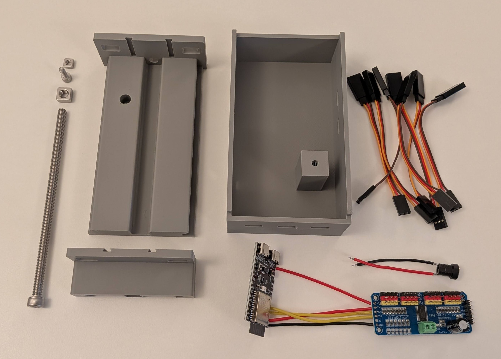

### 3D Printing

You can find all the CAD models used for this project under the `cad` directory.
It is composed of three main parts.
All parts can be 3D printed without supports, at 15% infill, and using regular PLA filament.

**1. The Device**

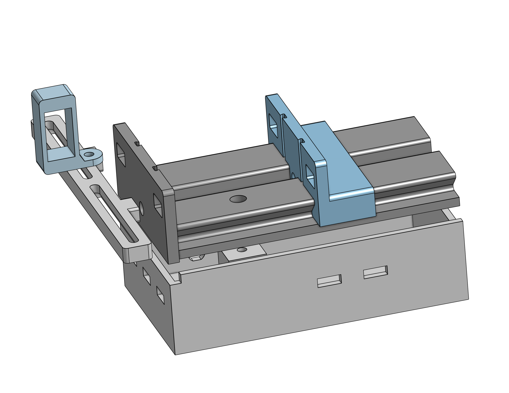

This is the body of the system.
It has a main box compartment where the electronics sit.
This is closed by placing the main vice rail on top of it, the two pieces are held together by a regular M4 bolt and a square nut.
The vice slides in from the side of the rail.
A 130mm M6 bolt is then passed through into a pressure-fit M6 square nut on the other end.
These are the only two screws on the main body.

The two rails on the sides of the device are pressure-fit into their corresponding holes.
Servo modules can be screwed onto those rails using a short M4 bolt and a square nut under the rail.

**2. The Vice Attachments**

Most remotes will be held in place just fine using the regular inner walls of the vice.

However, some remotes may require special attachments to be properly secured.

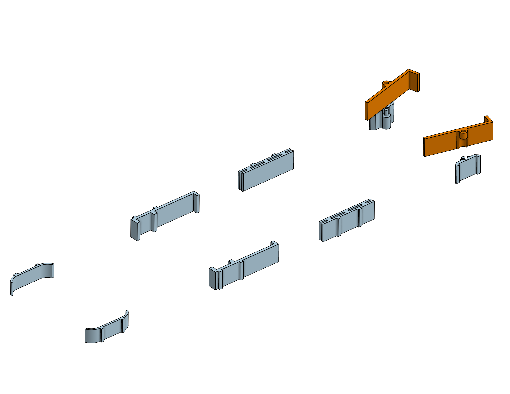

Here are a few ready-to-print attachments that should cover most needs.
There is one for small rounded remotes and another for remotes with angled edges, for example.
These attachments simply slide into the main body using the small inner rails on the vice's walls.

One of these attachments requires the use of a 2mm thick soft silicone sheet to provide a better grip on certain remotes.

**3. The Arms**

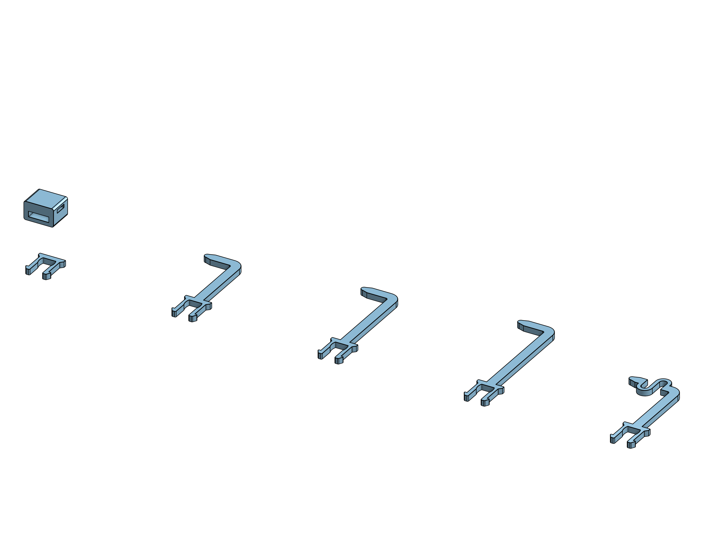

Three sizes of arm attachments are already available.
They are designed to clip directly into a buckle glued onto a servo's plastic arm.

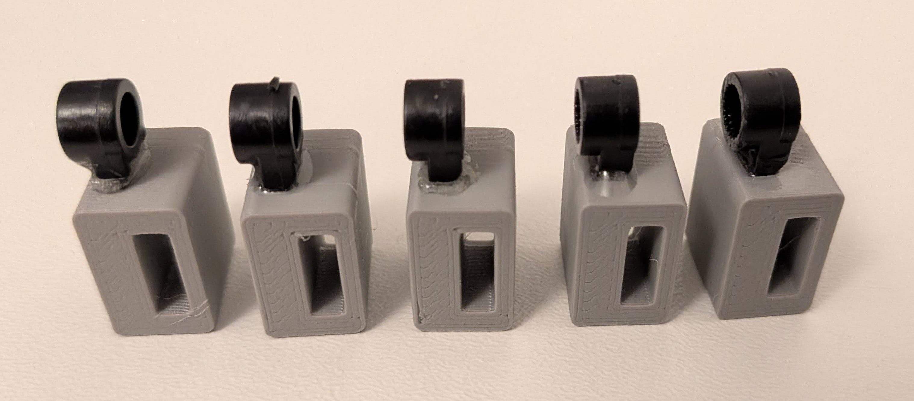

The arms are designed to be easily swapped when needed.

To print everything required to build a Helping-Hand module with 4 servo attachments, it takes approximately **5 hours of print time and 200 grams of filament**, depending on your printer and settings.

The entire mechanical design is built with modularity in mind.
There are a total of 4 interface points:

- The servo rail holes on the sides can accommodate different rails if needed.
- The vice attachment system can fit any custom designed walls, as long as they have the slit rails to slide onto the vice's inner walls.
- The servo modules can be swapped to use different kinds of servos, or have a different orientation.
- The servo buckle can be used with all sorts of arms, as long as they share the same base clip.

These interface points serve three main purposes:

- If a part breaks, such as an arm, a rail, or a servo module, you only need to replace that part, not the whole device.
- If a part does not fit your needs, such as for a particularly unusual remote, you can design your own and make it work with the rest of the device.
- You only use the number of parts required for the application: if you only need to access one button, for example, you might use a single rail and a single servo module.

### Electronics

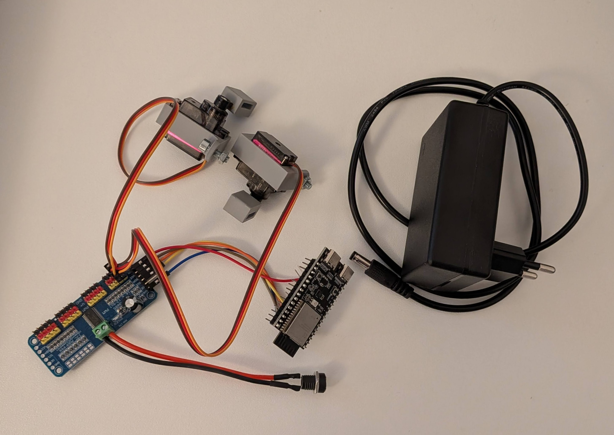

The electronics required for building a module are the following:

- A 5V 3A power supply
- An ESP-32 C6 microcontroller
- A PCA9685 servo controller
- MG90S servo motors
- A DC plug
- Electronics wires
- (Optionally) JR servo connectors

The image below describes the wiring schematic for the system:

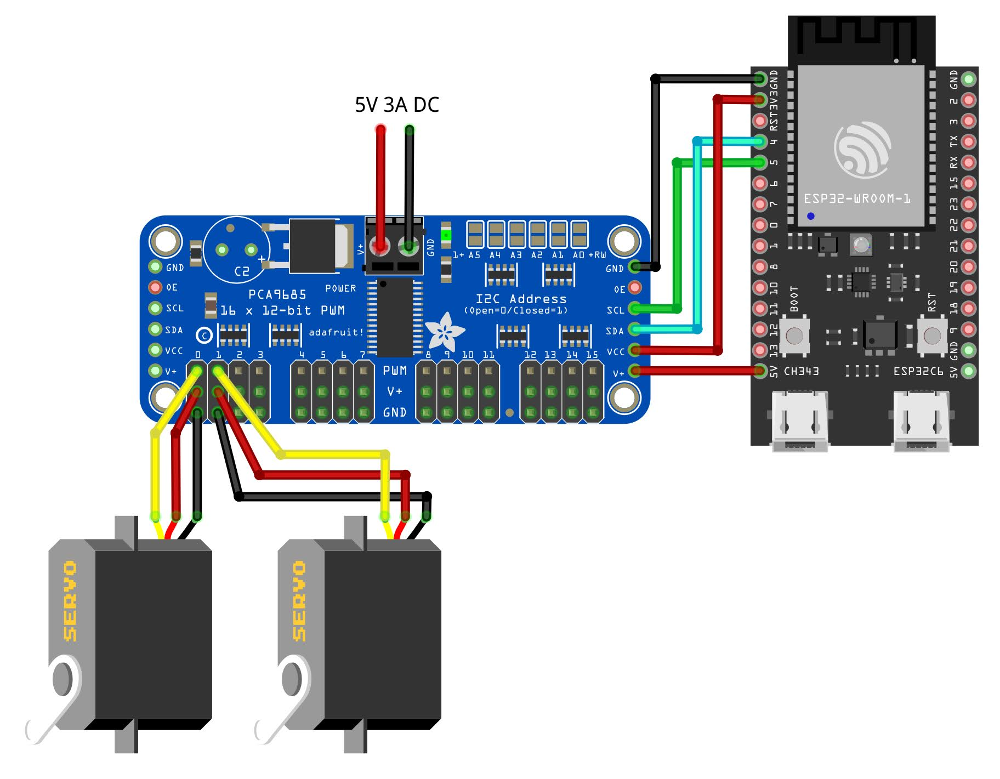

Once everything is connected it should look something like the following:

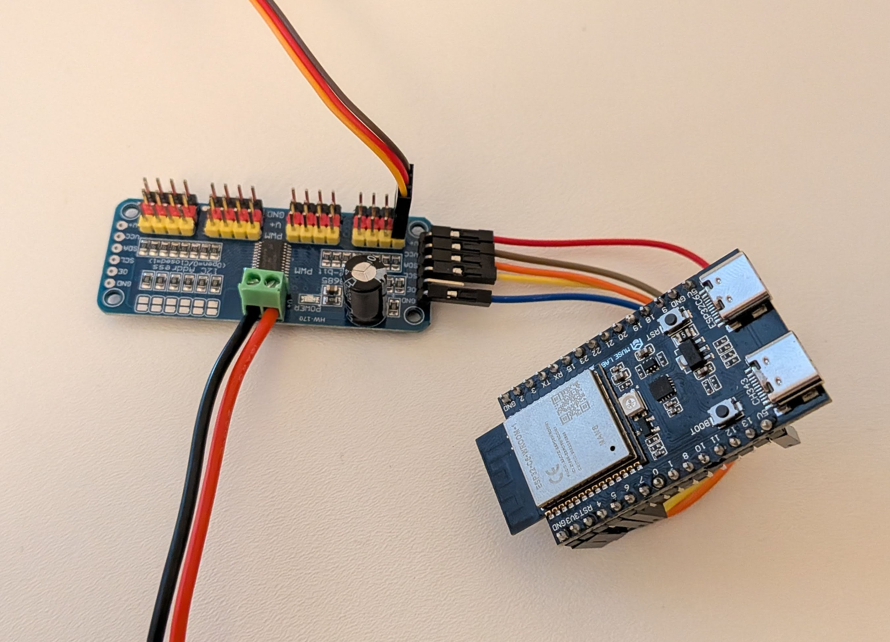

You can then install the electronics inside the main body of the system.
Regular hot glue can be used to fix the components in place, and a stronger glue can be used to secure the cable connectors to holes on the walls.

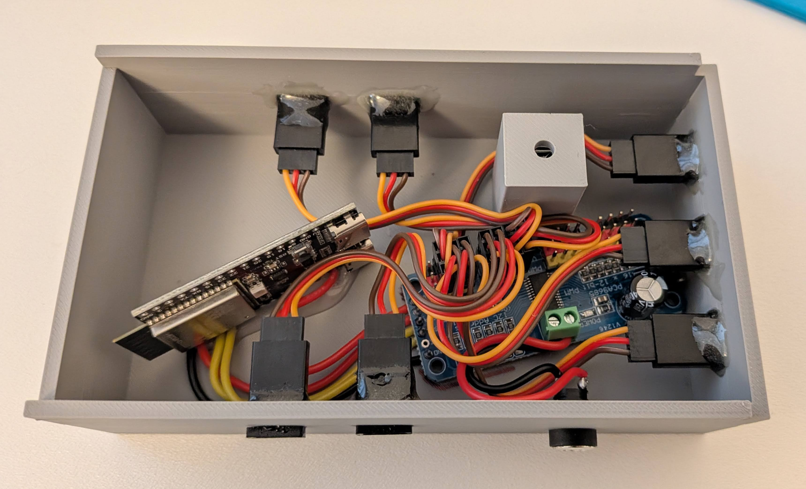

### Finished Device

A fully assembled system looks like the following:

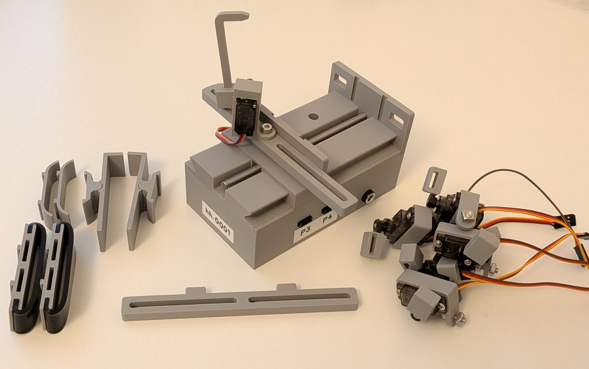

Accounting for all necessary materials, the total cost to build a full device is approximately **$46**, and it should take about **2 hours** to fully assemble (not including 3D printing time).

## Firmware

The firmware code for the ESP-32 C6 microcontroller is written in [Rust](https://rust-lang.org/).
The code is under the `firmware` directory.

It uses a modular architecture with 5 main parts:

- The **network** part is responsible for connecting to the Wi-Fi router and runs a reconnection mechanism every 30 seconds in case the connection drops.
- The **server** part is responsible for running an HTTP (and an HTTPS) server to receive and dispatch requests/responses.
- The **logic** part is responsible for handling the requests.
- The **servo** part exposes an API to control the servo motors through the PCA9685 via I2C.
- The **filesystem** part is used to persist the device's configuration across reboots.

The system is configured at build time using a `.env` file containing the following information:

```env
# .env

DEVICE_ID="0001"

NET_SSID="Helping-Hand"
NET_PWD="hh-test-net"
```

### Dev Environment

To compile and flash the firmware, you will need to install the required dependencies.

This process is simplified by using a Nix `flake.nix` file.

Simply run `nix develop` inside the `firmware` directory to have everything ready to go.
Learn more about Nix flakes here: <https://wiki.nixos.org/wiki/Flakes>

Once all dependencies are installed, you can run `cargo build` to build the firmware and `cargo run` to flash an ESP-32 C6 connected via USB.

## Software

The software for the Helping-Hand companion application is built in [Dart](https://dart.dev/) using the [Flutter](https://flutter.dev/) framework.
The code is under the `app` directory.

### User Interface

The companion app for controlling Helping-Hand devices has the following user interface:

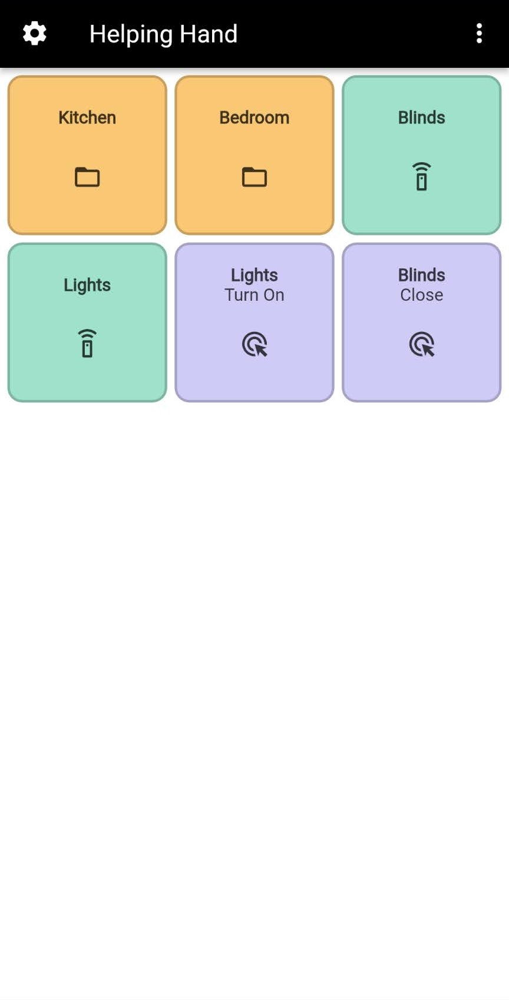

When opening the app, the user is taken directly to the home screen shown above.
Here they can find their different remotes and actions organized in tiles.

There are three types of tiles, each with a distinct icon and color:

- **Folder tiles** (orange): Allow grouping other tiles under a named location. The system supports nesting folders as deeply as needed.
- **Remote tiles** (green): Provide access to all the buttons configured on that remote.
- **Action tiles** (purple): Tapping this type of tile triggers a press of the corresponding button on that remote.

Remote tiles contain only the actions configured on the corresponding remote, while folder tiles (and the home screen) can contain any type of tile: folders, remotes, and action tiles directly.
This allows for quick actions directly from the home screen, or for creating a folder containing a subset of buttons from a given remote.

Inside a folder (or on the home page), the user can long-press tiles and then drag and drop to reorder them as desired.

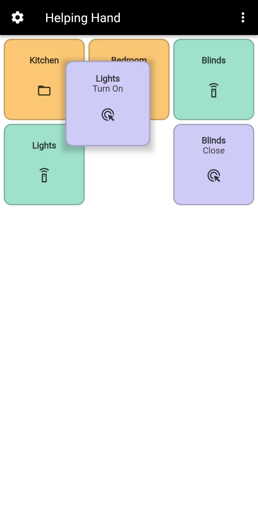

The user can use the following context menu to change things about the current view:

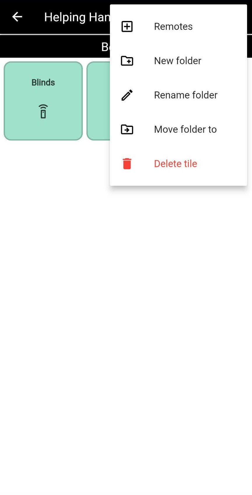

This allows for things like creating a new folder, renaming the current one, or moving it to a different location.
The user can also select the "Remotes" option to access the following screen:

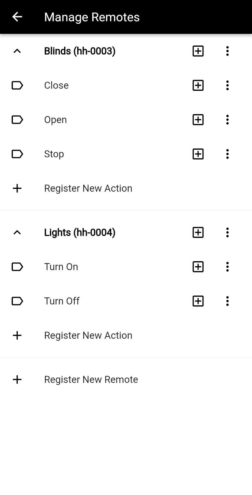

From here the user can click the "+" icon to add a remote or quick-action tile to the folder they came from.
This is also where the user can add and configure new remotes or buttons.

A remote's configuration is stored directly on the Helping-Hand device itself, not locally on the user's app.
Editing a remote's configuration (renaming it, adding or changing its actions, etc.) is done on this page and will be immediately available to any other user who has that remote installed in their app.
This is intentionally kept separate from the user's tiles referencing those remotes and actions, so that different users can organize their tiles to their liking, on each of their devices.

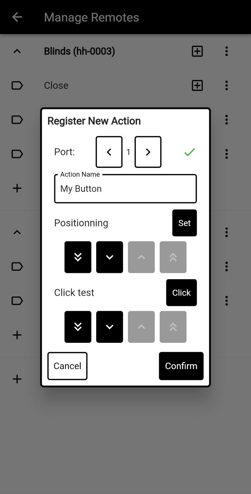

The process for configuring a new button is straightforward and follows the above form's inputs from top to bottom.
First, connect a servo module to one of the available ports on the device.
Then select that port using the arrow keys at the top of the form.
Type in the name of the new button and click on the "Set" button.
This will bring the arm connected to the selected servo module down close to the remote.
You can then use the up and down buttons to bring the servo closer and align it with the button you want to control.
Once it is properly aligned, tighten the screw on the rail and proceed to the "click" test.
Click the lowering button as many times as necessary until the remote registers the click.
Then click "Confirm" to save the new button.

#### Accessibility Mode

This mode is specifically designed for people with disabilities who may use alternative input systems.
For them, precisely targeting a specific tile may be difficult or could cause strain and physical fatigue.
On the home screen, the user (or caregiver) can access the settings and enable accessibility mode by clicking "Use Accessible UI".

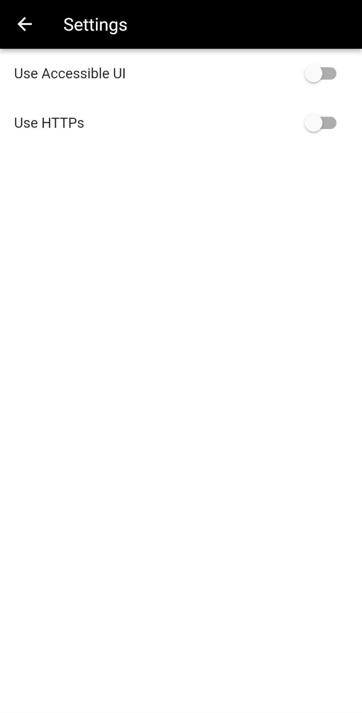

When returning to the home screen after enabling this mode, the system automatically cycles through the tiles, highlighting each one with a blue border in sequence.
Instead of targeting a specific tile, the user can tap anywhere on the screen to select the currently highlighted option.
This significantly increases the active input area and eliminates the need for precise tapping.

In this mode, other main screen actions (such as drag and drop to reorder) are disabled to prevent unintentional actions from harder to control input systems.
The top application bar is still active, as it is used to access the settings to disable accessibility mode.

**Note**: The "Use HTTPS" toggle is explained below (see [Note on iOS Devices](#note-on-ios-devices)).

#### Logo


The image above is the Helping-Hand logo.

It is used as the application icon, the web application's favicon, and is displayed on the splash screen when opening the app.

Its design follows the minimalistic and efficient aesthetic of the app.
The logo carries a dual meaning: it represents a home laid on its side, reflecting the system's home automation purpose, and it resembles a "play" or "do it" button icon, representing the act of performing an action like a button press.

### Dev Environment

Flutter is required to build and deploy the application.
You can follow the installation steps provided on the Flutter website for your system: <https://docs.flutter.dev/install>

Make sure the `flutter doctor -v` command runs without errors after installation.

To run the Helping-Hand application locally, execute the `flutter run` command inside the `app` directory.

Additionally, two build flags are available to facilitate development:

- `--dart-define=DEBUG_FAKE_REQUESTS=true`: Enables a fake interface with two mocked devices, `hh-0001` and `hh-0002`. All requests will have a fake delay and a 30% failure rate to test how the UI handles those cases. (Only has an effect in DEBUG mode.)
- `--dart-define=DEBUG_ERASE_DB=true`: Erases the local database on every build. This is useful for starting from a clean state and ensuring there is no residual state that could cause problems. (Only has an effect in DEBUG mode.)

## Security

As with any digital system, the security model of Helping-Hand is worth discussing.

The main safeguard here is access to your home Wi-Fi network.
Essentially, any device connected to the same Wi-Fi network as a Helping-Hand device is considered trusted to execute actions and reconfigure the device.
Devices outside that network will have no direct access to the device.

This security model therefore relies on having a strong and secure Wi-Fi password.
It also imposes a limitation on the system: it cannot be controlled if you are not connected to your home Wi-Fi.
This means it is not possible to use the system to open and close the blinds while you are away on vacation, for example.

Because the system is built with extensibility in mind, one could use a proxy device, such as a laptop or a Raspberry Pi, connected to the internet, to execute internal requests based on external commands.
Another solution would be to use a home VPN server.
However, either approach would increase the attack surface of the whole system, and therefore their security must be properly ensured.

### Browser Security

Although the Helping-Hand user interface is built with Flutter for cross-platform support, it currently only supports the web target.
This means it must follow the browser security model and account for CSRF protection and mixed-content policies.

The user interface web application must be served over HTTPS, not only for security reasons, but also because it uses the Web Worker API and local storage features, both of which require the site to be served over a secure connection.
This means any requests made by the website must also conform to the HTTPS protocol, as required by the mixed-content policy.
However, ESP32 microcontrollers are not full computers and are on the lower end of the performance spectrum in terms of the memory and CPU required to handle HTTPS connections.

Fortunately, a modern browser feature called [Local Network Access](https://wicg.github.io/local-network-access/) (LNA) allows HTTP requests to local network devices even from an HTTPS served website, thereby bypassing the mixed-content policy.
It simply asks the user to confirm that a given website is authorized to make such requests by showing a confirmation pop-up dialog once.
The firmware is configured to comply with the LNA specification and has the correct preflight request headers set up to inform the browser that this feature is supported.

Additionally, to prevent cross-site request forgery, the ESP-32 must respond to any request with the appropriate allow origin headers.
In debug mode it will allow any port of the `localhost` origin.
In release mode, the firmware only allows requests from a hardcoded URL, defaulting to the official Helping-Hand website's URL.

#### Note on iOS Devices

Apple has strict rules regarding iOS browsers, most notably that they must all use the WebKit engine.
Unfortunately, to this day Apple does not support the LNA browser feature in WebKit, meaning any mixed-content request, even to local network devices that correctly implement the preflight headers, will not be permitted.

This unfortunately necessitates the use of HTTPS to communicate locally with the microcontrollers on iOS devices, at least until Apple decides to implement the LNA feature.
This is currently handled in the project by running an HTTPS server on the microcontroller alongside the regular HTTP server, with a common logic handling process.
The microcontrollers therefore use self-signed certificates for each device, generated at compile time when flashing the chips.

iOS browsers will not accept these self-signed certificates by default, so they must first be downloaded to the iOS device by visiting `http://hh-0001.local/cert` (replacing `hh-0001` with the ID of the target Helping-Hand device).
The user can then follow the procedure described in `./docs/ios_cert.md` to save and trust that certificate.

To finally access the Helping-Hand device from the user interface, the user must enable HTTPS mode from the settings menu.

**Limitations**

This approach currently has 2 major limitations:

- The ESP32 C6 hardware can only support up to 3 simultaneous HTTPS connections.
- Apple's policy on self-signed certificates is that they can only be valid for a maximum of 1 year before automatically expiring. This requires opening the Helping-Hand device to reflash a new certificate once per year.

A more sustainable long-term solution would be to maintain and deploy a native iOS application (which is not cheap), or for Apple to eventually add LNA support to their web engine, or to allow other browser engines on their mobile devices.
